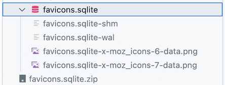
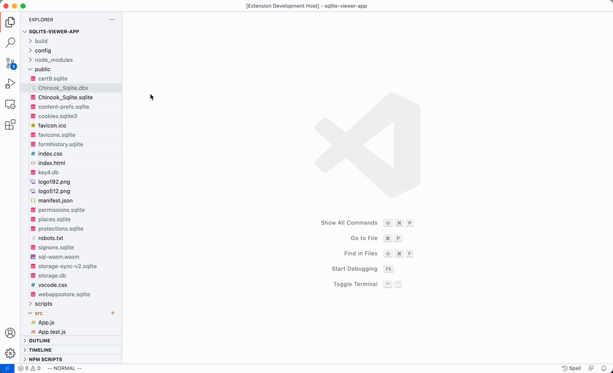

# CHANGELOG

## v0.8
### [SQLite Viewer PRO](https://vscode.sqliteviewer.app)
You can now upgrade SQLite Viewer to a fully-fledged database editor by upgrading to SQLite Viewer PRO. 
Like the base version, it's designed to "just work", even in remote workspaces like WSL, SSH, and containers. For more information check out [vscode.sqliteviewer.app](https://vscode.sqliteviewer.app) or the info popup inside the viewer. 
Users of the free version are not affected by this change.

### Secondary Sidebar
SQLite Viewer now features a second sidebar 🎉. It shows either the current row selection or meta data about the current table.

## v0.8.4
- [PRO] Made error messages more descriptive
- [PRO] Added a confirmation dialog before committing a transaction that contains too many changes to keep in the undo history. This usually occurs when deleting large numbers of rows.
- Fixed a bug that reset range selection when using pagination buttons or the scrollbar
- Other minor fixes

## v0.8.3
Minor fixes. Bumped to main release channel.

## v0.8.2 (Pre-Release)
No outside visible changes

## v0.8.1 (Pre-Release)
[PRO] Performance improvements

## v0.8.0 (Pre-Release)
Initial 0.8 release.

## v0.7.3
- The initial size of the sidebar is now based on available space
- Resizing the sidebar and columns should now work when using the extension with a web-based version of VSCode on and iPad or other touch device
- Row buttons no longer take up space while the row is not in the hovered state
- Various bug fixes and improvements

## v0.7.2
Fixed telemetry connection string error

## v0.7.1
Fixed version update banner from being shown again

## v0.7.0
- Added basic keyboard navigation support. It is still quite easy to lose the focus, especially when using Page Up/Page Down keys.
- Added button to collapse the sidebar
- Various minor fixes and improvements
- Added expand/collapse all button to tables sidebar
- It is now possible to __open more than one SQLite Viewer instance per file__. 
  Additionally, opening large files (~1GB) is now much faster, and opening additional tabs of the same file carries little additional cost.

Note that this release includes signification restructuring of the extension, which may cause (unrelated) issues.
Please [report](https://github.com/qwtel/sqlite-viewer-vscode/issues) any issues you encounter. 

## v0.6 (Pre-Release)
### Secondary Sidebar
~~SQLite Viewer now features a second sidebar 🎉. It shows either the current row selection or meta data about the current table.~~
This has been shelved for now, please remain on the pre-release channel if you need the sidebar.

## v0.6.7 (Pre-Release)
Code refactoring, no externally visible changes 

## v0.6.6 (Pre-Release)
Replaced 3rd party ad with 1st party ad: Check out [Hydejack](https://hydejack.com/?ref=vscode), a Jekyll theme for hackers, nerds, and academics, made by yours truly.

## v0.6.5 (Pre-Release)
Code refactoring, no externally visible changes 

## v0.6.4 (Pre-Release)
It is now possible to __open more than one SQLite Viewer instance per file__. 
Additionally, opening large files (~1GB) is now much faster, and opening additional tabs of the same file carries no additional cost beyond the webview itself. 

## v0.6.3 (Pre-Release)
Included latest changes from 0.5 branch
 
## v0.6.2 (Pre-Release)
- Improved keyboard support. Page Up/Page Down should now work in most cases
- Added expand/collapse all button to tables sidebar
- Fixed a performance regression when rendering a table for the first time

## v0.6.1 (Pre-Release)
Added basic keyboard support to table explorer and main view

## v0.5
### WAL Mode Support
This version introduces support for __reading WAL mode databases__. It works across all VSCode file systems including local, remote, and even on github.dev.

This fixes a common issue that caused the contents of a `-wal` file not being shown in the UI when the the auto checkpoint limit hadn't been reached.
This led to unsatisfying workarounds such as disabling WAL mode, triggering checkpoints manually or reducing the auto checkpoint limit.

While this update removes the need for the above workarounds, it does not change the readonly nature of the extension or remove the need to reload the file for updates to be visible in the UI.

Note that making this work required significant restructuring of the extension, which may cause (unrelated) issues. Please report any you may encounter. 

## v0.5.13
- Replaced 3rd party ad with 1st party ad: Check out [Hydejack](https://hydejack.com/?ref=vscode), a Jekyll theme for hackers, nerds, and academics, made by yours truly.

## v0.5.12
- Fixed an issue related to square brackets in column names

## v0.5.11
- Fixed an issue that caused the update notification to re-appear each time VSCode was restarted

## v0.5.10
- Fixed an issue that caused an entire file to crash when some tables/views are using custom functions
- Fixed an issue that caused rendering artifacts and column resizing issues in empty tables

## v0.5.9
Improved column filtering:
- Added a button to invert a colum filter
- Added a button to filter a column non-nullish (`NULL` or empty string) values. You can combine it with the invert button to filter for nullish values instead.
- Typing `NULL` or `''` into the column filter will now filter by null or empty string values respectively.
- Changed representation of empty strings from `""` to `''`. This is to match the filter values above and to distinguish it from the legitimate search target `""`, which can come up in combination with JSON(B) columns. If you need to search for the exact string sequence `''`, use escape characters: `\'\'`.
- Fixed a bug that caused column filters to not properly reset when deleting the contents of the search box

Experimental support for Views:
- SQLite Viewer can now view Views. Note that there is a known performance issue for on large views. This feature will retain the "Experimental" qualifier until I can resolve it.
- Added button to expand/collapse all tables and view in the sidebar

## v0.5.8
- Limiting webview Content Security Policy to environments that are known to work.
This should (finally) make this extension work with GitPod and Google IDX.
- Fixed download button height in detail view 
- Reduced bundle size (< 1MB)

## v0.5.7
The extension now adds configuration settings for nesting SQLite-related files:

This has no effect if you aren't using VSCode's File Nesting feature. You may enable it in settings under "Explorer > File Nesting: Enabled".

If you use file nesting, but do not want to nest SQLite files, you can manually delete the patterns from the settings page under "Explorer > File Nesting: Patterns". SQLite Viewer will not attempt to set the patterns again, unless explicitly requested through the command "SQLite Viewer: Add SQLite File Nesting Patterns".

This version also changes the file name of downloaded blobs to be prefixed with `-x-`, e.g. `favicons.sqlite-x-moz_icons-10-data.bin`. This ensures that downloaded blobs will be sorted below `-wal`, `-shm` and `-journal` files, reducing the risk of accidentally interacting with them when range-selecting downloaded files.

### Fixes
- Downgraded minimum vscode version to 1.83.1. This should make the Open VSX version of the extension work with Google IDX
- Removed special characters from codicons asset path. This should make icons render correctly when using the Open VSX version of the extension in GitPod
- Fixed an error when setting max file size to 0

## v0.5.6
Fixed a potential memory issue by limiting memory usage to configured file size limit

## v0.5.5
Bumped WAL Mode support to main channel.

### Changes
- Autofocus in detail view should now work when the query takes longer to finish
- Added better loading indicator to detail view
- Minor performance improvement for detail view query

## v0.5.4 (Pre-Release)
- Generated columns are now shown
- Fixed showing `ROWID` column for tables that were created without row ids

## v0.5.3 (Pre-Release)
Fixed an issue that prevented the extension from loading on github.dev in Safari

## v0.5.2 (Pre-Release)
Added Content-Security-Policy to extension webview

## v0.5.1 (Pre-Release)
No publicly visible changes

## v0.5.0 (Pre-Release)
Initial v0.5 pre-release

## v0.4
### Solid Rewrite
SQLite Viewer 0.4 is a complete rewrite of this extension with a focus on improved performance.

It also implements SQLite Viewer's **most requested feature**: Default file association for `.db` files! 

Additionally, version 0.4 ships many quality of life improvements:

- Double clicking a cell will now open the modal and pre-select the text content
- The extension will now attempt to auto-size text columns based on visible content on first open
- Blob columns containing known image formats are previewed inline
- Blob columns up to 256 bytes (that aren't images) are rendered in hex format instead of as a download button
- Pinning a row will no longer remove it from the main view
- Columns can now be hidden in the sidebar
- The `ROWID` column can now be displayed (enable in sidebar)
- It is now possible to select and rearrange multiple columns at the same time in the sidebar
- The modal/dialog view can now be resized
- Downloading a blob will now automatically add an appropriate file extension if it can be inferred
- Column sizes and pinned now persist when switching to another table (but not after closing the tab/file) 

### Performance
- Faster virtualized scrolling
- Faster columns resizing

### Style
- Many aspects of the extension's UI should match VSCode's style closer

## v0.4.14
- Generated columns are now shown
- Fixed showing `ROWID` column for tables that are created without a `ROWID`
- Fixed an issue that prevented the extension from loading on github.dev in Safari

## v0.4.12 – v0.4.13
Fixed an issue that prevented text selection when using the extension on the web in the latest version of Chrome

## v0.4.11
- Tables in sidebar are now sorted alphabetically 
- Fixed foreign key icon not being shown, or being shown on wrong column 
- Fixed text in foreign key tooltip referencing wrong column names 

## v0.4.10
- SQLite updated to 3.45.3
- Fixed an issue that sometimes caused text selection to be slow

## v0.4.9
Fixed an issue that prevented files from loading correctly when connected to a workspace via SSH

## v0.4.8
- The detail view has a new, cleaner look that closer matches similar components in VSCode
- Added extension name and version number to the bottom left

## v0.4.7
- Fixed visible cells updating to new values immediately after refreshing a file
- Fixed an issue that caused the UI to become non-interactive when showing an error message

## v0.4.6
- Added button to filter columns by exact search term
- Removed "Not Allowed" cursor from readonly fields in detail view
- Improved startup time by avoiding unnecessary copying when opening a file

## v0.4.5
Fixed an issue that caused the extension to go blank when opening an external link

## v0.4.4
### Features
Improved JSON column support
- JSON columns are now shown as textarea instead of a one-line input in detail view
- JSON textarea defaults to 6 rows instead of 2 in detail view
- JSON values are now rendered in monospace font
- JSON values are now pretty printed in detail view

### Fixes
- Unknown column types now default to textarea instead of one-line input

### Style
- Better differentiation between empty strings and NULL by showing them as `""` instead of `NULL`

## v0.4.3
### Fixes
- Added back search functionality for tables
- Fixed ROWID column sizing
- Fixed a browser history issue when using the extension on the web

## v0.4.2
### Fixes
- Fixed column widths resetting when refreshing a file
- Fixed column order resetting when refreshing a file
- Fixed an issue causing the grid to collapse when refreshing a file
- Fixed sidebar column order not updating when pinning a column
### Style
- Increased default column width by 20%

## v0.4.1
Added essential application reporting

## v0.4.0
Initial v0.4 release

## v0.3.0 – v3.0.24
Minor bug fixes and previews 

## v0.2.4
- Added max file size setting

## v0.2.3
- Fixed opening FTS4 & FTS5 files
- Fixed showing large integers
- Fixed showing booleans
- Fixed opening files exported by pandas `.to_sql`

## v0.2.2
Prerelease version

## v0.2.1
Prerelease version

## v0.2.0
Prerelease version

## v0.1.5
* Fixed a bug that caused the SQLite WebWorker to be initialized twice
* Updated dependencies
  * Updated SQLite to 3.38.0

## v0.1.4
* Updated dependencies
  * Updated SQLite to 3.37.2
  * Updated React v18 to latest Release Candidate

## v0.1.3
* Added ref to external link

## v0.1.2
### Fixes
* Opening files with the R*Tree extension will no longer produce an error
* Binary values are now always rendered as download buttons, even when not specified as `BLOB` type

### Other
* Updated dependencies
  * Updated React to v18 Release Candidate

## v0.1.1
### Fixes
* Show error message when trying to open SQLite file using extensions

## v0.1.0
You can now open any file with SQLite Viewer and set SQLite Viewer as default for any file extension:

### Changes
* Removed the `.db` file association, as it is too generic to be permanently associated with SQLite Viewer. 
You can easily restore the old behavior through VSCode's Open With menu.
* Updated dependencies
  * Updated React to v18 Beta
  * Updated React Router to v6

### Fixes
* Fixed a transparency issue with fixed columns with certain color themes

## v0.0.1 – v0.0.24
* Replaced Emojis with Codicons for better VSCode integration
* Added support for pinning columns and rows
* Added reload button 
* Column virtualization: Tables with many columns should no longer impact UI performance
* Added keyboard shortcuts
  - Ctrl+F/Cmd+F: Focus global search
  - Ctrl+R/Cmd+R: Reload content
